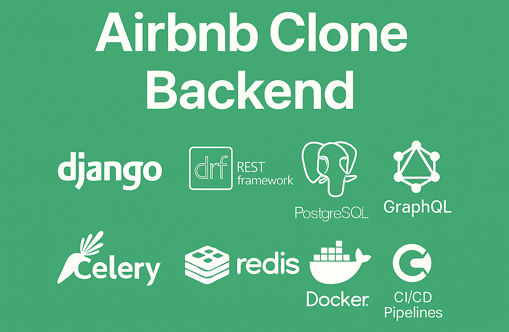

# Airbnb Clone Backend

## ✨ Project Overview
The backend for the Airbnb Clone project is designed to replicate the essential functionalities of Airbnb, offering a scalable and secure environment for user interactions, property listings, bookings, payments, and reviews. This platform aims to ensure a smooth and reliable experience for both users and hosts.

## 🏆 Project Goals
- **User Management:** Secure registration, login, and profile management.
- **Property Management:** Enable creation, retrieval, and management of property listings.
- **Booking System:** Support reservations with detailed booking management.
- **Payment Processing:** Integrate a secure payment system.
- **Review System:** Allow users to leave ratings and feedback.
- **Data Optimization:** Use indexing and caching for performance improvements.

## 👥 Team Roles

### Product Owner
Responsible for the product vision and ensuring that the final product meets business needs.

### Project Manager
Oversees the project timelines, budget, and team coordination. Ensures delivery within scope.

### Business Analyst
Gathers and interprets business requirements, translating them into actionable development tasks.

### UI/UX Designer
Designs intuitive user interfaces and optimal user experiences.

### Software Architect
Defines the software architecture, selects technologies, and ensures code quality standards.

### Backend Developer
Implements the core logic, APIs, and database interactions.

### QA Engineer
Tests the application for functionality, performance, and security.

### Test Automation Engineer
Creates and maintains automated tests for faster and consistent validation.

### DevOps Engineer
Manages deployments, CI/CD pipelines, and infrastructure.

## 🛠️ Technology Stack
- **Django:** High-level Python web framework for building robust RESTful APIs.
- **Django REST Framework (DRF):** Facilitates REST API development with built-in features like authentication and serialization.
- **PostgreSQL:** Relational database system for storing structured data.
- **GraphQL:** Enables efficient and flexible data querying.
- **Celery:** Handles asynchronous tasks like sending notifications.
- **Redis:** Used for caching and task queue management.
- **Docker:** Ensures consistent development and deployment environments.
- **CI/CD Pipelines:** Automates testing and deployment using tools like GitHub Actions.

## 📈 Database Design

### Entities and Relationships

#### 1. **Users**
- `id`: Unique identifier
- `username`: Unique name
- `email`: Contact email
- `password`: Hashed password
- `role`: User or Host

#### 2. **Properties**
- `id`: Unique identifier
- `user_id`: References User
- `title`: Property title
- `location`: Address
- `price`: Price per night

**Relation:** A user can own multiple properties.

#### 3. **Bookings**
- `id`: Unique identifier
- `user_id`: References User
- `property_id`: References Property
- `check_in`: Start date
- `check_out`: End date

**Relation:** A booking is made by a user for a property.

#### 4. **Payments**
- `id`: Unique identifier
- `booking_id`: References Booking
- `amount`: Payment amount
- `status`: Success/Failure
- `timestamp`: Date of transaction

**Relation:** Each booking has one payment.

#### 5. **Reviews**
- `id`: Unique identifier
- `user_id`: References User
- `property_id`: References Property
- `rating`: Score
- `comment`: Text review

**Relation:** Users can leave multiple reviews, one per property per booking.

## ⚙️ Feature Breakdown

### User Management
Provides user registration, login, and profile editing. Ensures only authenticated users can access protected resources.

### Property Management
Enables hosts to create and manage property listings. Supports CRUD operations with data validation.

### Booking System
Allows users to book properties for specific dates. Handles check-in/check-out tracking and conflicts.

### Payment Processing
Securely processes payments linked to bookings. Tracks payment status and provides receipts.

### Review System
Users can leave feedback and ratings on properties after completing a booking.

### API Documentation
REST and GraphQL endpoints are documented with OpenAPI and introspection for easy integration.

### Performance Optimization
Uses database indexing and Redis-based caching to enhance performance and reduce load.

## 🔐 API Security

- **Authentication:** Uses token-based authentication to verify user identity.
- **Authorization:** Role-based permissions ensure users can only access allowed resources.
- **Rate Limiting:** Protects APIs from abuse by limiting request frequency.
- **Data Validation:** Prevents injection and malicious input.
- **Secure Payments:** Encrypts sensitive payment information and uses trusted payment gateways.

**Importance:**
- Protects personal and financial data
- Prevents unauthorized access
- Ensures trust in the platform

## ⚙️ CI/CD Pipeline

CI/CD (Continuous Integration and Continuous Deployment) automates code testing, building, and deployment, ensuring faster and safer releases.

**Benefits:**
- Early bug detection
- Fast and consistent deployment
- Reduced manual errors

**Tools:**
- **GitHub Actions:** For running automated tests and deployments on code push
- **Docker:** For creating reproducible environments across development and production
- **Celery with Redis:** For handling asynchronous background tasks
